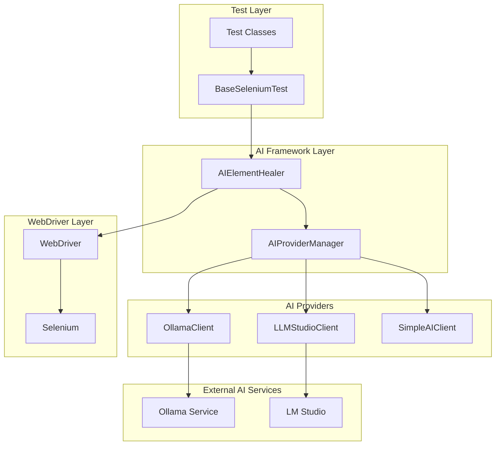
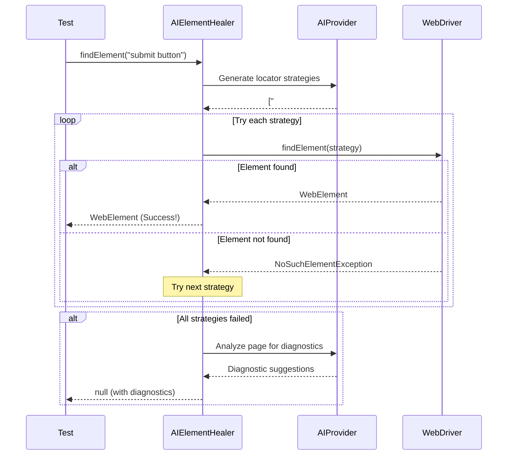

# 🏠 AI Framework Architecture

## 📋 Overview

This document describes the architecture and design principles of the AI-powered self-healing test automation framework.

## 🏗️ High-Level Architecture



## 📎 Core Components

### 1. AIElementHealer

**Purpose**: Main interface for AI-powered element location

**Responsibilities**:
- Accept natural language element descriptions
- Generate multiple locator strategies using AI
- Try strategies until element is found
- Cache successful strategies for performance
- Provide diagnostics and error analysis

**Key Methods**:
```java
public WebElement findElement(String description)
public List<WebElement> findElements(String description) 
public String getDiagnostics(String description)
```

### 2. AIProviderManager

**Purpose**: Manages multiple AI providers with automatic failover

**Responsibilities**:
- Discover available AI providers
- Implement provider priority and fallback logic
- Health check and monitoring
- Resource management and cleanup

**Provider Priority**:
1. Ollama (Primary - Best performance)
2. LM Studio (Secondary - Good performance)
3. Simple AI (Fallback - Basic functionality)

### 3. LLMInterface

**Purpose**: Abstract interface for AI providers

**Contract**:
```java
public interface LLMInterface {
    String generateResponse(String prompt);
    String generateResponse(String prompt, float temperature, int maxTokens);
    boolean isAvailable();
    String getModelInfo();
    void close();
}
```

## 🔄 Self-Healing Process Flow



## 🧠 AI Provider Architecture

### Ollama Client

```java
public class OllamaClient implements LLMInterface {
    private final String baseUrl;     // http://localhost:11434
    private final String model;       // llama3
    private final OkHttpClient client;
    private final ObjectMapper mapper;
    
    // Connection management
    // Request/response handling
    // Error handling and retries
}
```

**Features**:
- Local model execution
- No API costs
- High performance
- Privacy-focused

### LM Studio Client

```java
public class LLMStudioClient implements LLMInterface {
    private final String baseUrl;     // http://localhost:1234  
    private final OkHttpClient client;
    private final ObjectMapper mapper;
    
    // OpenAI-compatible API
    // Model management
    // Performance monitoring
}
```

**Features**:
- GUI model management
- OpenAI API compatibility
- Easy model switching
- Good performance

### Simple AI Client

```java
public class SimpleAIClient implements LLMInterface {
    private final Map<String, String> responses;
    
    // Predefined response patterns
    // Keyword matching
    // Fallback functionality
}
```

**Features**:
- No external dependencies
- Instant responses
- Basic locator suggestions
- Always available

## 🔍 Locator Generation Strategy

### AI Prompt Engineering

```java
String prompt = String.format(
    "You are a Selenium WebDriver expert. Generate CSS selectors and XPath expressions " +
    "to find this element: '%s' on a web page.\n\n" +
    "Provide 5 different locator strategies in this exact format:\n" +
    "1. By.id(\"element-id\")\n" +
    "2. By.className(\"class-name\")\n" +
    "3. By.name(\"element-name\")\n" +
    "4. By.cssSelector(\"css-selector\")\n" +
    "5. By.xpath(\"//xpath-expression\")",
    elementDescription
);
```

### Response Parsing

```java
public List<By> parseAILocators(String aiResponse) {
    List<By> locators = new ArrayList<>();
    String[] lines = aiResponse.split("\n");
    
    for (String line : lines) {
        if (line.contains("By.id")) {
            String id = extractValue(line, "By.id");
            locators.add(By.id(id));
        }
        // Parse other locator types...
    }
    
    return locators;
}
```

### Strategy Priority

1. **ID-based**: Highest priority (most stable)
2. **Name-based**: High priority (form elements)
3. **Class-based**: Medium priority (can change)
4. **CSS Selector**: Medium priority (flexible)
5. **XPath**: Lowest priority (most fragile)

## 📋 Caching and Performance

### Strategy Caching

```java
public class LocatorCache {
    private final Map<String, List<By>> cache = new ConcurrentHashMap<>();
    private final long TTL = 300_000; // 5 minutes
    
    public List<By> getStrategies(String description) {
        CacheEntry entry = cache.get(description);
        if (entry != null && !entry.isExpired()) {
            return entry.getStrategies();
        }
        return null;
    }
    
    public void putStrategies(String description, List<By> strategies) {
        cache.put(description, new CacheEntry(strategies, System.currentTimeMillis()));
    }
}
```

### Performance Optimizations

- **Strategy Caching**: Cache successful locator strategies
- **Connection Pooling**: Reuse HTTP connections to AI services
- **Async Processing**: Generate multiple strategies in parallel
- **Circuit Breaker**: Fail fast when AI provider is down
- **Timeout Management**: Prevent hanging on slow AI responses

## 🔒 Error Handling and Resilience

### Exception Hierarchy

```java
public class AIFrameworkException extends RuntimeException {
    // Base exception for all AI framework errors
}

public class AIProviderException extends AIFrameworkException {
    // AI provider connection or response errors
}

public class HealingException extends AIFrameworkException {
    // Element healing specific errors
}

public class ConfigurationException extends AIFrameworkException {
    // Configuration and setup errors
}
```

### Retry Logic

```java
public WebElement findElementWithRetry(String description, int maxRetries) {
    for (int attempt = 1; attempt <= maxRetries; attempt++) {
        try {
            return findElement(description);
        } catch (Exception e) {
            if (attempt == maxRetries) {
                throw new HealingException(
                    String.format("Failed to find element after %d attempts: %s", 
                    maxRetries, description), e);
            }
            
            // Exponential backoff
            try {
                Thread.sleep(1000 * attempt);
            } catch (InterruptedException ie) {
                Thread.currentThread().interrupt();
                throw new HealingException("Interrupted during retry", ie);
            }
        }
    }
    return null;
}
```

### Circuit Breaker Pattern

```java
public class AIProviderCircuitBreaker {
    private enum State { CLOSED, OPEN, HALF_OPEN }
    
    private State state = State.CLOSED;
    private int failureCount = 0;
    private long lastFailureTime = 0;
    private final int failureThreshold = 5;
    private final long timeout = 60_000; // 1 minute
    
    public String callAI(String prompt) throws AIProviderException {
        if (state == State.OPEN) {
            if (System.currentTimeMillis() - lastFailureTime > timeout) {
                state = State.HALF_OPEN;
            } else {
                throw new AIProviderException("Circuit breaker is OPEN");
            }
        }
        
        try {
            String response = aiProvider.generateResponse(prompt);
            onSuccess();
            return response;
        } catch (Exception e) {
            onFailure();
            throw e;
        }
    }
    
    private void onSuccess() {
        failureCount = 0;
        state = State.CLOSED;
    }
    
    private void onFailure() {
        failureCount++;
        lastFailureTime = System.currentTimeMillis();
        if (failureCount >= failureThreshold) {
            state = State.OPEN;
        }
    }
}
```

## 📊 Monitoring and Metrics

### Performance Metrics

```java
public class AIFrameworkMetrics {
    private final AtomicLong totalRequests = new AtomicLong();
    private final AtomicLong successfulRequests = new AtomicLong();
    private final AtomicLong failedRequests = new AtomicLong();
    private final AtomicLong totalResponseTime = new AtomicLong();
    
    public void recordRequest(long responseTime, boolean success) {
        totalRequests.incrementAndGet();
        totalResponseTime.addAndGet(responseTime);
        
        if (success) {
            successfulRequests.incrementAndGet();
        } else {
            failedRequests.incrementAndGet();
        }
    }
    
    public double getSuccessRate() {
        long total = totalRequests.get();
        return total > 0 ? (double) successfulRequests.get() / total : 0.0;
    }
    
    public double getAverageResponseTime() {
        long total = totalRequests.get();
        return total > 0 ? (double) totalResponseTime.get() / total : 0.0;
    }
}
```

### Health Checks

```java
public class AIProviderHealthCheck {
    public HealthStatus checkHealth() {
        try {
            // Test simple AI request
            String response = aiProvider.generateResponse("Test prompt");
            
            if (response != null && !response.trim().isEmpty()) {
                return HealthStatus.HEALTHY;
            } else {
                return HealthStatus.UNHEALTHY;
            }
        } catch (Exception e) {
            return HealthStatus.UNHEALTHY;
        }
    }
}
```

## 🔧 Configuration Management

### Configuration Sources

1. **Properties Files**: `ollama-config.properties`, `llmstudio-config.properties`
2. **System Properties**: `-Dai.provider.timeout=30`
3. **Environment Variables**: `AI_PROVIDER_URL=http://localhost:11434`
4. **Programmatic**: `config.setProperty("timeout", "30")`

### Configuration Hierarchy

```java
public class AIConfiguration {
    private final Properties config = new Properties();
    
    public AIConfiguration() {
        loadDefaults();
        loadFromPropertiesFile();
        loadFromSystemProperties();
        loadFromEnvironmentVariables();
    }
    
    private void loadDefaults() {
        config.setProperty("ai.timeout", "30");
        config.setProperty("ai.retries", "3");
        config.setProperty("ai.cache.ttl", "300");
    }
}
```

## 🛡️ Security Considerations

### Data Privacy
- Element descriptions may contain sensitive information
- AI providers should be local (Ollama, LM Studio)
- No data sent to external services without explicit consent

### Network Security
- AI services run locally by default
- HTTP connections use localhost only
- No authentication tokens stored in code

### Input Validation
- Sanitize element descriptions
- Validate AI responses before parsing
- Prevent injection attacks through prompts

## 🚀 Scalability

### Horizontal Scaling
- Multiple AI provider instances
- Load balancing between providers
- Distributed caching

### Vertical Scaling
- Connection pooling
- Async request processing
- Efficient memory management

### Performance Tuning
- Optimize AI prompt templates
- Tune cache TTL values
- Monitor and adjust timeouts

This architecture supports a robust, scalable, and maintainable AI-powered test automation framework.