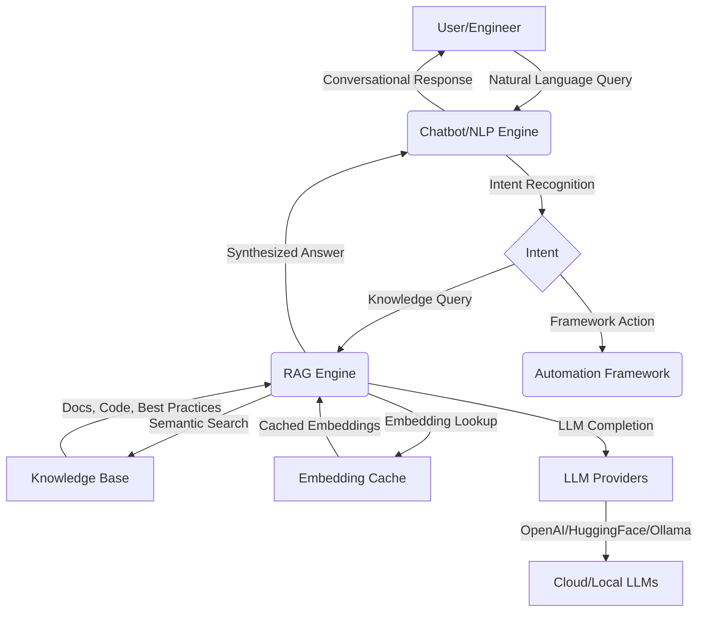

# RAG+NLP Chatbot Demo for Test Automation Framework

## 🚀 Overview
This demo showcases the Retrieval-Augmented Generation (RAG) and NLP-powered chatbot built into the K11 Tech Lab Selenium Java Automation Framework. The chatbot delivers context-aware, framework-specific answers, generates test cases, and provides conversational assistance for automation engineers.

---

## Key Features
- **Retrieval-Augmented Generation (RAG):** Combines LLMs (OpenAI, Ollama, HuggingFace, LM Studio) with a persistent knowledge base.
- **Configurable AI Provider Pipeline:** Select and prioritize providers via config.
- **Strict Knowledge-Base-Only Mode:** Ensures answers are grounded in your framework docs/code.
- **Modern Chatbot GUI:** Branded, user-friendly interface with source references and timestamps.
- **Test Automation Ready:** Generates, explains, and troubleshoots Selenium test cases.

---

## 1. Launching the Chatbot GUI


Run the following command or launch from your IDE:
```java
public static void main(String[] args) {
    javax.swing.SwingUtilities.invokeLater(() -> {
        new ChatbotGUI().setVisible(true);
    });
}
```

---

## 2. Asking Framework-Specific Questions


```java
String question = "How do I implement a self-healing Selenium locator?";
String answer = chatbot.answerFrameworkQuestionOnly(question);
System.out.println(answer);
```

---

## 3. Generating Test Cases


```java
String testPrompt = "Generate test cases for an e-commerce checkout flow.";
String testCases = chatbot.answerFrameworkQuestionOnly(testPrompt);
System.out.println(testCases);
```

---

## 4. Configuration Example

```properties
# chatbot.ai.properties
chatbot.rag.maxContextLength=3000
chatbot.rag.maxTokens=1200
chatbot.rag.maxRetrievedDocs=3
ai.provider.priority=OPENAI,OLLAMA,SIMPLE
```

---

## 5. Architecture Diagram



---

## 6. Why Use This Chatbot?
- Get instant, accurate answers grounded in your own framework.
- Save time, reduce onboarding friction, and boost test coverage and quality.
- Robust, extensible, and ready for enterprise use.

---

*For more details, see the full documentation in `testartifacts/docs/AI_Testing_Assistant/nlp/NLP_Chatbot_Implementation_Article.md`.*
