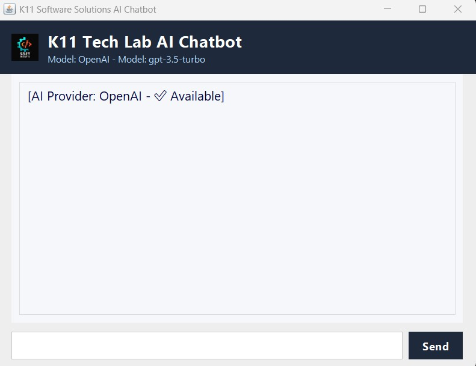
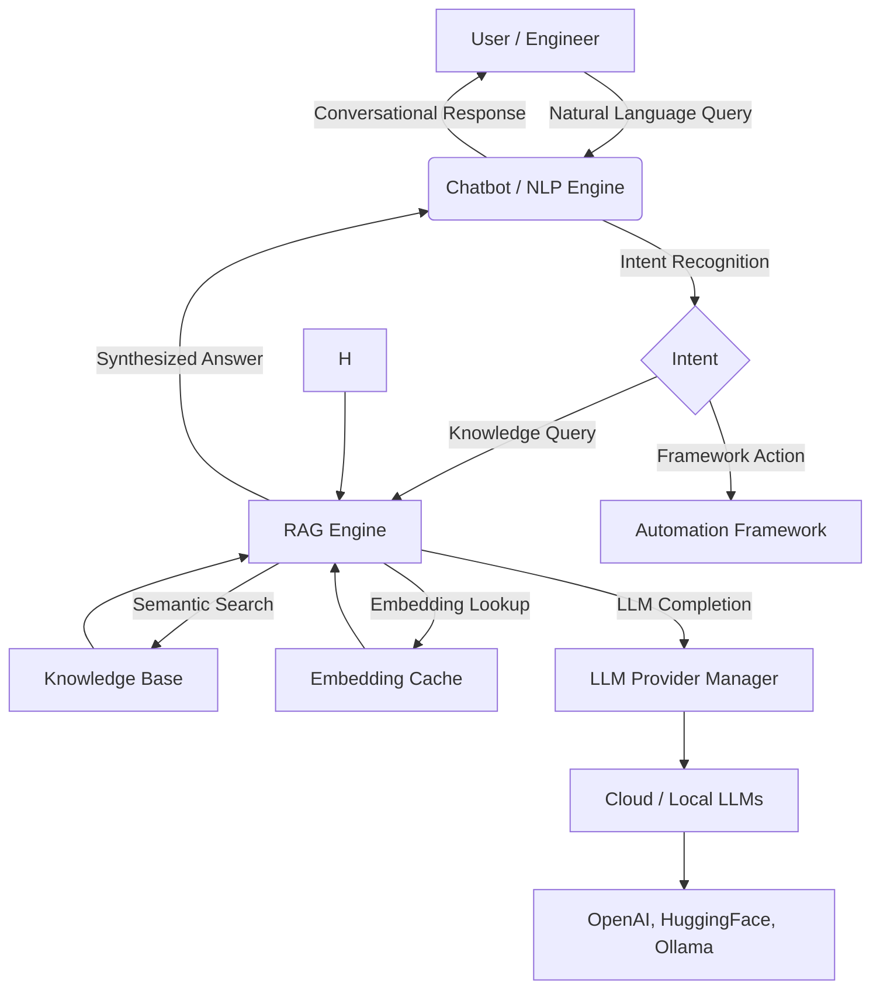

# RAG+NLP Chatbot Demo for Test Automation Framework

## 🏃‍♂️ Execution Instructions

1. **Build the project:**
   ```sh
   mvn clean package
   ```
2. **Run the Chatbot GUI:**
   - From the command line:
     ```sh
     java -cp target/classes org.k11techlab.framework.ai.chatbot.ChatbotGUI
     ```
   - Or, from your IDE, run the `main` method in `ChatbotGUI.java`.
3. **Run RAGKnowledgeChatbot or StrictFrameworkRAGChatbot from CLI:**
      ```sh
     java -cp target/classes org.k11techlab.framework.ai.chatbot.RAGKnowledgeChatbot
     java -cp target/classes org.k11techlab.framework.ai.chatbot.StrictFrameworkRAGChatbot
     ```
   - Or, create a small demo class with a `main` method that instantiates and uses these classes.
4. **Configure AI providers and RAG settings:**
   - Edit `config/chatbot.ai.properties` to set provider order, max tokens, context length, etc.
5. **(Optional) Use screenshots and code samples below to explore features.**

---

## 🚀 Overview
This demo showcases the Retrieval-Augmented Generation (RAG) and NLP-powered chatbot built into the K11 Tech Lab Selenium Java Automation Framework. The chatbot delivers context-aware, framework-specific answers, generates test cases, and provides conversational assistance for automation engineers.

---

## Key Features
- **Retrieval-Augmented Generation (RAG):** Combines LLMs (OpenAI, Ollama, HuggingFace, LM Studio) with a persistent knowledge base.
- **Configurable AI Provider Pipeline:** Select and prioritize providers via config.
- **Strict Knowledge-Base-Only Mode:** Ensures answers are grounded in your framework docs/code.
- **Modern Chatbot GUI:** Branded, user-friendly interface with source references and timestamps.
- **Test Automation Ready:** Generates, explains, and troubleshoots Selenium test cases.

---

## 1. Launching the Chatbot GUI



Run the following command or launch from your IDE:
```java
public static void main(String[] args) {
    javax.swing.SwingUtilities.invokeLater(() -> {
        new ChatbotGUI().setVisible(true);
    });
}
```

---

## 2. Asking Framework-Specific Questions


```java
String question = "How do I implement a self-healing Selenium locator?";
String answer = chatbot.answerFrameworkQuestionOnly(question);
System.out.println(answer);
```

---

## 3. Generating Test Cases


```java
String testPrompt = "Generate test cases for an e-commerce checkout flow.";
String testCases = chatbot.answerFrameworkQuestionOnly(testPrompt);
System.out.println(testCases);
```

---

## 4. Configuration Example

```properties
# chatbot.ai.properties
chatbot.rag.maxContextLength=3000
chatbot.rag.maxTokens=1200
chatbot.rag.maxRetrievedDocs=3
ai.provider.priority=OPENAI,OLLAMA,SIMPLE
```

---


## 5. Why Use This Chatbot?
- Get instant, accurate answers grounded in your own framework.
- Save time, reduce onboarding friction, and boost test coverage and quality.
- Robust, extensible, and ready for enterprise use.

---

## 6.🗺️ Chatbot RAG+NLP Flow (Mermaid)



---

## 7. References
- [Full Implementation Article](testartifacts/docs/AI_Testing_Assistant/nlp/NLP_Chatbot_Implementation_Article.md)
- [RAGKnowledgeChatbot.java](src/main/java/org/k11techlab/framework/ai/chatbot/RAGKnowledgeChatbot.java)
- [StrictFrameworkRAGChatbot.java](src/main/java/org/k11techlab/framework/ai/chatbot/StrictFrameworkRAGChatbot.java)
- [ChatbotGUI.java](src/main/java/org/k11techlab/framework/ai/chatbot/ChatbotGUI.java)
- [RAGEnhancedAIClient.java](src/main/java/org/k11techlab/framework/ai/rag/RAGEnhancedAIClient.java)
- [AIProviderManager.java](src/main/java/org/k11techlab/framework/ai/manager/AIProviderManager.java)
- [Sample Properties](config/chatbot.ai.properties)
- [Demo Screenshots](testartifacts/assets/demo_screenshots/chatbot_nlp/)
