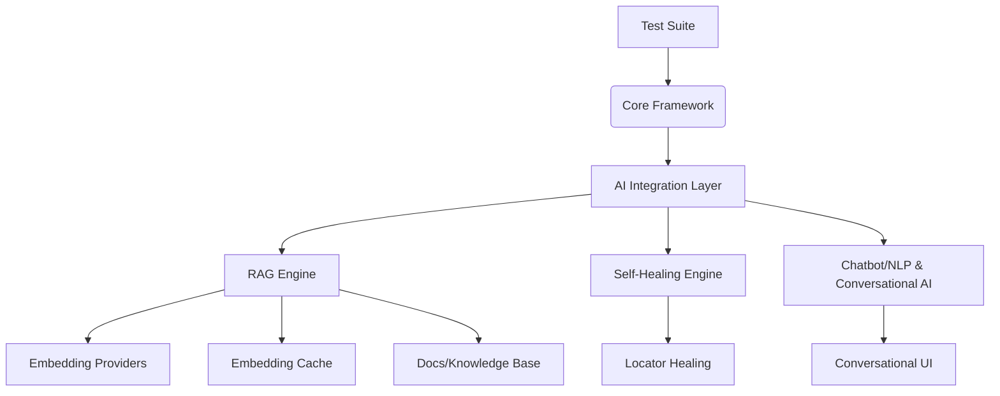

# K11 Tech Lab – Selenium Java Automation Framework

Getting Started with the Java-Based End-to-End Test Automation Framework:

This Java-based test automation framework is designed to support **end-to-end test coverage** across web, API, and database layers, with seamless CI/CD integration and enterprise-grade extensibility.


---

## ✅ Core Features

- **Web UI Testing** using Selenium WebDriver  
- **API Testing** with REST-assured and Java SAAJ for SOAP  
- **Database Validation** via JDBC with SQL/NoSQL utility support  
- **Test Data Management** with Excel, JSON, database queries, and runtime data generation  
- **Dynamic Configuration** using `.properties`, `.yaml`, or `.json` with CLI/CI parameters  
- **Structured Logging & Reporting** with Log4j/SLF4J, ExtentReports, email and screenshot support  
- **CI/CD Ready**: Jenkins, GitHub Actions, GitLab, and cloud execution (e.g., Sauce Labs)  


# 🚀 AI-Powered Features

- **Self-Healing Test Automation:**
   - AI-powered element locator healing for resilient UI tests
   - Automatically recovers from locator changes using semantic context and RAG
   - Reduces test flakiness and maintenance effort
- **Retrieval-Augmented Generation (RAG):**
   - Semantic search and answer synthesis over your test docs and codebase
   - Supports OpenAI, HuggingFace, and local Ollama embeddings
   - Multi-provider, local/cloud, and offline AI support
- **Persistent Embedding Cache:**
   - Embeddings are computed once per document chunk and reused for all future runs
   - Massive speedup and cost savings for repeated queries
- **Chatbot/NLP & Conversational AI:**
   - Conversational UI for natural language queries
   - Integrates with RAG and knowledge base for context-aware answers
   - Supports both local and cloud LLMs

Built entirely with open-source libraries, this framework is **fully extensible**—ready to scale for validations involving files, emails, microservices, or third-party system integrations.

---

## 🧱 Architecture Overview


### 📊 High-Level Diagram


> *Selenium Automation Framework Architecture — © 2025 Kavita Jadhav. All rights reserved.*

---

### 🤖 AI Features Integration Architecture



> *AI Features Integration: Shows how RAG, embedding cache, and self-healing plug into the core automation framework. Render this diagram with Mermaid for a visual overview.*


# 🤖 AI Enhancements (2025)

This framework now includes advanced AI-powered features for smarter, context-aware automation and documentation search:

- **Self-Healing Test Automation:**
   - AI-powered element locator healing for resilient UI tests
   - Automatically recovers from locator changes using semantic context and RAG
   - Reduces test flakiness and maintenance effort
- **Retrieval-Augmented Generation (RAG):**
   - Semantic search and answer synthesis over your test docs and codebase
   - Supports OpenAI, HuggingFace, and local Ollama embeddings
   - Multi-provider, local/cloud, and offline AI support
- **Persistent Embedding Cache:**
   - Embeddings are computed once per document chunk and reused for all future runs
   - Massive speedup and cost savings for repeated queries
- **AI Demo & Documentation:**
   - [Self-Healing Demo/Test Class](https://github.com/K11-Software-Solutions/k11TechLab-selenium-java-fullstack-framework/blob/main/src/main/java/org/k11techlab/framework/ai/selenium/selfhealing/SelfHealingDemo.java)
   - [RAGComponentsDemo.java (RAG Test Class)](https://github.com/K11-Software-Solutions/k11TechLab-selenium-java-fullstack-framework/blob/main/src/main/java/org/k11techlab/framework/ai/rag/demo/RAGComponentsDemo.java)
   - [Sample Output (Cache Hits!)](https://github.com/K11-Software-Solutions/k11TechLab-selenium-java-fullstack-framework/blob/main/RAGComponentsDemo_output.txt)
   - [RAG Demo Article & How-To](https://github.com/K11-Software-Solutions/k11TechLab-selenium-java-fullstack-framework/blob/main/RAG_Demo.md)

These enhancements make the framework ready for next-generation, AI-assisted, and self-healing test automation and knowledge retrieval.


The framework is composed of well-structured layers to ensure **modularity**, **maintainability**, and **scalability** across complex enterprise test environments.

### 1️⃣ Framework Layer – *The Foundation*
- Driver management (Selenium Grid/local/cloud)
- Config loading from external files
- Page Object Model (POM) structure
- Test data provider (Excel/JSON/DB)

### 2️⃣ Utility Classes – *Powering Reusability*
- Wait utilities (explicit/implicit/fluent)
- File, JSON, Excel handlers
- REST & SOAP service clients
- DB interaction (JDBC-based)
- Locator and email utilities

### 3️⃣ Automated Test Suite – *The Execution Brain*
- Test cases built on Base Test structure
- POM-based interactions
- Data-driven via `@DataProvider`
- Configurable execution (env, role, browser)
- Domain-Specific Language (DSL) support for readability

### 4️⃣ Test Execution – *Anywhere, Anytime*
- Run tests locally, via Docker, VMs, or cloud (Sauce Labs, BrowserStack)
- Supports headless execution
- Retry analyzer and failure recovery
- Data cleanup & environment reset utilities

### 5️⃣ CI/CD Integration – *Automating the Pipeline*
- Jenkins / GitHub Actions ready
- Parameterized build support
- Maven-based dependency management
- Artifactory/Nexus for internal libs

### 6️⃣ Error Handling and Recovery Scenarios – *Resilience First*
- Centralized exception handling
- Custom exception types
- Retry mechanism (TestNG-based)
- Safe teardown and recovery logic

### 7️⃣ Logging and Reporting – *Know What Happened, Instantly*
- ExtentReports/Allure HTML reports
- Log4j/SLF4J structured logs
- Screenshot capture on failure
- Email notifications with test summaries

### 8️⃣ Framework Capabilities & Extensibility
- Supports **Web, Mobile, SOAP, REST API** testing
- Dynamic configuration & data handling
- Cloud-ready & DevOps integrated
- Extensible for:
  - File-based validations (local/FTP)
  - Email workflows
  - Microservices architecture
  - Localization, accessibility, performance testing

---

## 🏗️ Technologies Used

- Java 8+
- Selenium WebDriver
- REST-assured
- SAAJ API
- TestNG
- Apache POI / Jackson / Gson
- Log4j / SLF4J
- ExtentReports / Allure
- JDBC
- Maven

---

## 🔧 Setup & Configuration

### 📦 Prerequisites

- Java 11+  
- Maven 3.6+  
- Git  
- Chrome or Firefox browser  
- IDE (e.g., IntelliJ, Eclipse)

### 🚀 Clone the Repository

```bash
git clone https://github.com/K11-Software-Solutions/k11-techlab-selenium-java-automation-framework.git
cd k11-techlab-selenium-java-automation-framework
```

### ⚙️ Configuration

1. **Edit config files** in:
   ```
   src/test/resources/config/
   ```
   Customize:
   - `baseUrl`
   - `browser`
   - Timeouts, credentials, etc.

2. **Ensure browser drivers** (e.g., ChromeDriver) are in system path or configured in test base.

3. **Use TestNG XML** for specific suites:
   ```
   src/test/resources/testng/
   ```

---

## 🧪 Running Tests

```bash
mvn clean test
mvn clean test -DsuiteXmlFile=smoke.xml
```

---

## 📊 Reporting

```bash
mvn allure:report
allure serve target/allure-results
```

---

## 📦 Use Cases

- UI regression and smoke testing  
- Cross-browser automation  
- Framework learning or extension baseline  
- CI integration with test reporting

---

## 📄 License

This project is licensed under the **MIT License** – see the [LICENSE](LICENSE) file for details.

---

## 📬 Contact

For consulting, training, or implementation support:  
🔗 [softwaretestautomation.org](https://www.softwaretestautomation.org)  
📧 kavita.jadhav.sdet@gmail.com
