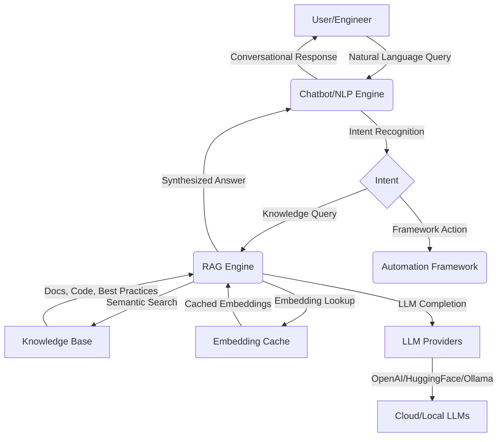

# Implementing NLP and Chatbot in the K11 Tech Lab Selenium Java Automation Framework

## Overview
This article explains how Natural Language Processing (NLP) and Chatbot/Conversational AI capabilities were integrated into the K11 Tech Lab Selenium Java Automation Framework. The goal is to enable natural language queries, conversational UI, and context-aware automation using both cloud and local Large Language Models (LLMs).

---

## 🗂️ Architecture Diagram (Mermaid)



---

## 1. Motivation
Modern test automation frameworks benefit from AI-driven features that:
- Allow users to interact with the framework using natural language (e.g., "Show me failed tests for login module last week")
- Provide conversational assistance for debugging, documentation, and test authoring
- Integrate with Retrieval-Augmented Generation (RAG) for context-rich answers

---

## 2. Architecture
The integration follows a modular approach:
- **AI Integration Layer**: Sits between the core framework and AI engines
- **RAG Engine**: Handles semantic search and answer synthesis
- **Chatbot/NLP Engine**: Manages conversational UI and natural language understanding
- **Embedding Providers**: OpenAI, HuggingFace, and local Ollama for embeddings and LLMs
- **Embedding Cache**: Ensures fast, cost-effective repeated queries

See the "AI Features Integration Architecture" Mermaid diagram in the README for a visual overview.

---

## 3. Key Components

### a. Conversational UI
- Accepts user queries in plain English
- Supports both CLI and (optionally) web-based chat interfaces
- Routes queries to the NLP engine for intent detection and response generation

### b. NLP & Intent Recognition
- Uses LLMs (OpenAI, HuggingFace, Ollama) to parse user input
- Extracts intent (e.g., run tests, fetch report, explain error)
- Maps intent to framework actions or RAG queries

### c. RAG-Enhanced Answers
- For knowledge-based queries, the RAG engine retrieves relevant docs/code
- Synthesizes answers using LLMs, grounded in project context

### d. Embedding & Caching
- All user queries and docs are embedded for semantic search
- Embeddings are cached for performance and cost savings

---

## 4. Implementation Steps

1. **Add AI Integration Layer**: Created a new module to handle all AI-related features.
2. **Integrate LLM Providers**: Abstracted embedding and completion APIs for OpenAI, HuggingFace, and Ollama.
3. **Build Conversational UI**: Implemented a CLI-based chat interface (web UI optional).
4. **Intent Recognition**: Used LLMs to classify user queries and extract actionable intents.
5. **RAG Integration**: Linked the chatbot to the RAG engine for context-aware answers.
6. **Persistent Embedding Cache**: Ensured all embeddings are cached and reused.
7. **Extensibility**: Designed the system to support new intents, providers, and UI channels.

---

## 5. Advanced Features

### Retrieval-Augmented Generation (RAG)
- Combines LLMs (OpenAI, Ollama, HuggingFace, LM Studio, and more) with a persistent, indexed knowledge base.
- Retrieves the most relevant documentation, code snippets, and best practices, then synthesizes answers using the latest LLMs.
- Ensures responses are grounded in your actual framework and project context.

### Configurable AI Provider Pipeline
- Provider selection is fully config-driven. Prioritize OpenAI, HuggingFace, or local models like LM Studio—no code changes required.
- Automatic fallback to available providers for reliability.

### Persistent Embedding Cache
- All knowledge base documents are embedded and cached for fast retrieval.
- Enables real-time, context-rich answers without repeated API calls.

### Strict Knowledge-Base-Only Mode
- The chatbot can be set to answer strictly from the framework’s knowledge base.
- If no relevant knowledge is found, it gracefully informs the user—no hallucinated or off-topic answers.

### Modern, Branded Chatbot GUI
- Beautiful, modern Swing UI with custom branding, logo, and dynamic responder/model info.
- Chat messages are formatted with name/timestamp headers and clear source references for every answer.

### Fully Configurable via Properties
- All key parameters—context length, max tokens, number of retrieved docs, provider order—are set in a simple properties file.
- Tuning and scaling the chatbot is effortless for any team or project.

### Test Automation & Demo Ready
- The chatbot can generate, explain, and troubleshoot Selenium test cases, and even create AI-generated tests in a dedicated, configurable output folder.
- Built for both demo wow-factor and real-world productivity.

---

## 6. Code Samples

### Instantiating the Chatbot with RAG
```java
LLMInterface baseProvider = new OpenAIClient(); // or OllamaClient, etc.
StrictFrameworkRAGChatbot chatbot = new StrictFrameworkRAGChatbot(baseProvider);
```

### Asking Framework-Specific Questions
```java
String question = "How do I implement a self-healing Selenium locator?";
String answer = chatbot.answerFrameworkQuestionOnly(question);
System.out.println(answer);
```

### Configuring RAG and LLM Parameters
```properties
# chatbot.ai.properties
chatbot.rag.maxContextLength=3000
chatbot.rag.maxTokens=1200
chatbot.rag.maxRetrievedDocs=3
ai.provider.priority=OPENAI,OLLAMA,SIMPLE
```

### Provider Selection (Config-Driven)
```java
AIProviderManager manager = new AIProviderManager();
LLMInterface provider = manager.getBestProvider();
```

### Generating Test Cases with the Chatbot
```java
String testPrompt = "Generate test cases for an e-commerce checkout flow.";
String testCases = chatbot.answerFrameworkQuestionOnly(testPrompt);
System.out.println(testCases);
```

### Modern Chatbot GUI (Swing Example)
```java
public static void main(String[] args) {
    javax.swing.SwingUtilities.invokeLater(() -> {
        new ChatbotGUI().setVisible(true);
    });
}
```

---

## 7. Why It Matters
- Engineers get instant, accurate answers grounded in their own framework.
- Teams save time, reduce onboarding friction, and boost test coverage and quality.
- The system is robust, extensible, and ready for enterprise use.

---

## 8. Technologies Used
- Java 8+
- OpenAI API, HuggingFace Transformers, Ollama (local LLMs)
- Custom RAG and embedding cache modules
- CLI and (optionally) web chat UI

---

## 9. Extending the Chatbot
- Add new intents by updating the intent recognition logic
- Plug in new LLM providers as needed
- Extend UI to web or messaging platforms

---

## 10. Benefits
- Natural language access to framework features
- Faster onboarding and support for new users
- Context-aware, accurate answers grounded in project knowledge
- Extensible for future AI/automation needs

---

## 11. References
- [RAGComponentsDemo.java](src/main/java/org/k11techlab/framework/ai/rag/demo/RAGComponentsDemo.java)
- [SelfHealingDemo.java](src/main/java/org/k11techlab/framework/ai/selenium/selfhealing/SelfHealingDemo.java)
- [README.md](README.md)

---

*For questions or contributions, contact the project maintainer or open an issue on GitHub.*
